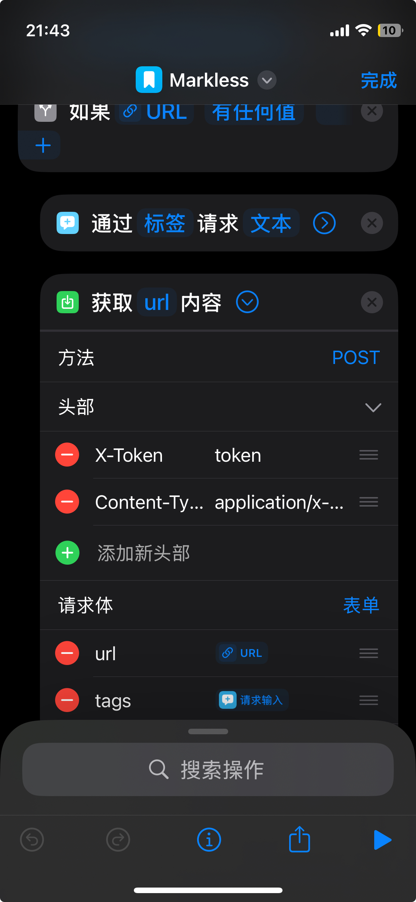

<p align="center"></p>

<p align="center"><a href="./README.md">English</a>｜<a href="./README-zh.md">中文</a></p>


Markless
===

A very simple bookmark manager that only collects, organizes, and manages bookmarks.

* Simple and lightweight
* Deployment-friendly, only includes one executable file
* Uses `Sqlite`
* Basic `GO` + `HTML` + `CSS` + `JS`


Features：

- [x] Support dark mode
- [x] Collect web pages through browser plugins/IOS shortcuts
- [x] Support multiple users
- [x] Support marking unread/read and categorizing with tags
- [x] Support multiple languages
- [x] Support snapshots, saving the content of a link at a certain moment to prevent link expiration.
- [ ] Import and parse bookmarks exported from browsers
- [ ] Export bookmarks (json format, with tags)


👀 [demo](https://wsh233.cn/webapp/markless)   username：`demo` passwrord：`demo1234`

Usage
===

Enter the following command to view the startup parameters.

```bash
markless -h
```


**Collect webpages through broswer plugin**

The code of the browser plugin is also open-source, and the code is in the `crx` file. After [downloading](./example/markless-chrome-extension.crx), unzip and install it.


Start the instance, and then generate the `key`.


Open the browser plugin options, copy and paste the `instance address` and `key`.


Then you can start collecting web pages, the *link* is a required field, other information such as *title*, *description*, etc. will be automatically parsed if not filled out.


**Collect webpages through iOS shortcuts.**

Download the shortcut [here](./example/Markless.shortcut), modify and fill in the `url` with the actual address, and insert the token value obtained from installing the browser plugin in the `X-Token` of the request header.
<p align="center"></p>

After double-clicking on the shortcut command, enter the detailed information and enable `Show in shared form`.


<p align="center"></p>


<p align="center"></p>

In `Safari`, sharing a webpage allows you to see Markless, click to `bookmark` the page.


Thanks
===

Inspired by the following two open source projects:

* [linkding](https://github.com/sissbruecker/linkding)

* [miniflux](https://github.com/miniflux/v2)

The project uses many open source packages, thank you to the authors ❤️

