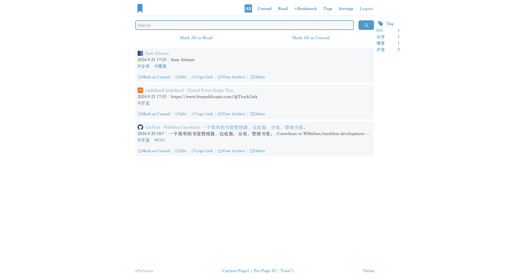
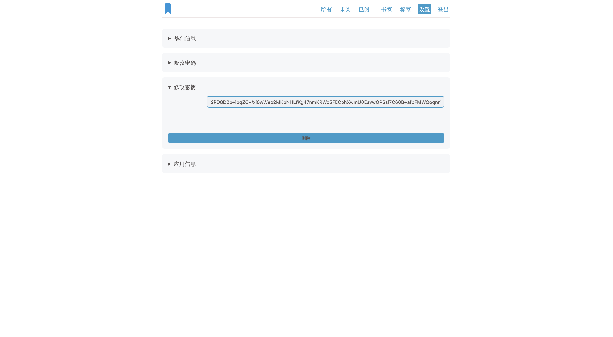

<p align="center"></p>

Markless
===

一个非常简单的书签管理器，仅收集，分类，管理书签。

* 简洁轻量
* 部署友好，仅包含一个可执行文件
* 使用`Sqlite` 
* 基础的`GO` + `HTML` + `CSS` + `JS`
* 支持黑暗模式
* 可通过浏览器插件/IOS快捷指令收集网页
* 支持多用户
* 支持多标签
* 支持多语言（目前有中文简/繁体，英文，日文）




[demo 地址](https://wsh233.cn/webapp/markless)  用户名：`demo` 密码：`demo1234`


使用
===

查看启动命令参数

```bash
markless -h
```

参数说明

* -baseurl: 部署根路由， 默认 `/`
* -databaseurl：sqlite路径 ，默认自动创建在程序所在目录
* -port：端口 ，默认`5000`
* -title：网站名称，默认`markless`
* -adminname：默认管理员名称，默认`admin`
* -password：默认管理员密码，默认`admin1234`


**通过浏览器插件收集网页**

浏览器的代码也是开源，源代码就在`crx`文件里，[下载](./example/markless-chrome-extension.crx)后，解压安装，


启动实例，然后生成`密钥`



打开浏览器插件选项，复制后粘贴`实例地址和`密钥`


然后就能通过收集网页了，*链接*是必填项，其他如*标题*，*描述*等信息不填写的话程序会自动解析。


**通过IOS快捷指令收藏网页**

[下载](./example/Markless.shortcut)快捷指令，修改并填写`url`为实例地址，请求头部里的`X-Token`填入前面安装浏览器插件获取的token值。
<p align="center"></p>

双击快捷指令后，进入详细信息，开启`在共享表单中显示`


<p align="center"></p>


<p align="center"></p>

`Safari`里分享网页，就能看见Markless了，点击即可收藏该网页。


待完成
===

* 导入解析浏览器导出的书签

* 导出书签（json格式，带标签）
* 快照（保存某一时刻的网页内容，防止链接失效内容消失）


感谢
===

由下面两个开源项目启发而成❤️：

* [linkding](https://github.com/sissbruecker/linkding)

* [miniflux](https://github.com/miniflux/v2)

项目用到许多开源包，感谢那些作者

